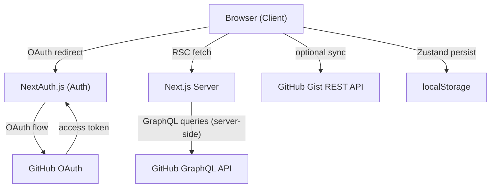
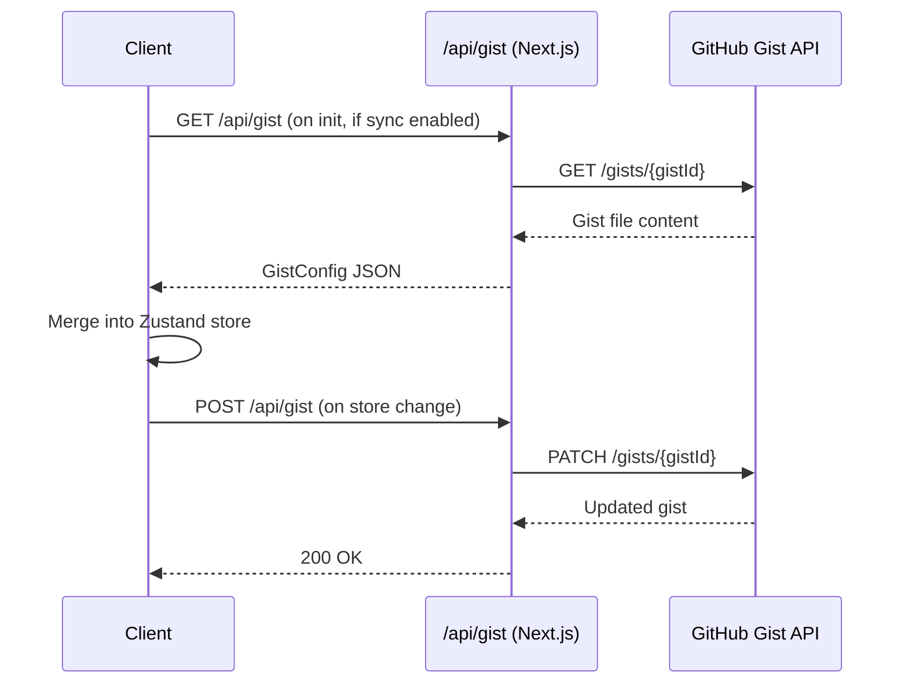

# Design Document: RepoPulse

## Overview

RepoPulse is a local-first, stateless Next.js web application that serves as a personal GitHub repository dashboard. It authenticates users via GitHub OAuth (NextAuth.js), fetches repository and profile data from the GitHub GraphQL API in Server Components, and stores all user preferences (groups, local paths, sort/filter state) client-side using Zustand with localStorage persistence. An optional sync layer writes preferences to a private GitHub Gist for cross-device availability.

### Key Design Decisions

- **Server-side data fetching**: GitHub API calls happen in Next.js Server Components so the access token never reaches the client bundle.
- **Client-side state only**: No database. All mutable user preferences live in Zustand + localStorage (and optionally a Gist).
- **Stateless server**: The Next.js server holds no per-user state between requests beyond the NextAuth session cookie.
- **Fuzzy search on the client**: fuse.js runs entirely in the browser against the already-fetched repository list.

---

## Architecture



### Request Flow

1. Unauthenticated user visits `/` → sees landing page with "Sign in with GitHub".
2. NextAuth.js handles the OAuth redirect, requesting `repo`, `read:user`, and `gist` scopes.
3. On successful auth, the session cookie is set and the user is redirected to `/dashboard`.
4. The `/dashboard` route is a React Server Component that reads the session token server-side and issues GraphQL queries to GitHub.
5. Fetched data is streamed to the client as serialized props; no token is included.
6. Client-side Zustand store hydrates from localStorage on mount and manages all interactive state.

---

## Components and Interfaces

### Page Structure

```
app/
  page.tsx                  # Landing / sign-in page (Server Component)
  dashboard/
    page.tsx                # Dashboard shell (Server Component, fetches data)
    loading.tsx             # Suspense skeleton
  api/
    auth/[...nextauth]/
      route.ts              # NextAuth.js route handler
    gist/
      route.ts              # Gist read/write proxy (protects token server-side)

components/
  ProfileHeader.tsx         # Avatar, handle, bio
  StatCard.tsx              # Single metric card (repos, stars, followers, following)
  EfficiencyBar.tsx         # Search input + Sort By + Hide Forks toggle
  BentoGrid.tsx             # Responsive CSS grid wrapper
  RepoCard.tsx              # Individual repository card
  LocalPathPopover.tsx      # Inline popover for linking a local path
  GroupNav.tsx              # Group navigation sidebar/tabs
  CommandPalette.tsx        # ⌘K overlay
  EmptyState.tsx            # Reusable empty state message component

lib/
  github.ts                 # GraphQL query functions (server-side only)
  gist.ts                   # Gist API helpers (server-side only)
  fuzzy.ts                  # fuse.js wrapper (client-side)
  store.ts                  # Zustand store definition

types/
  index.ts                  # Shared TypeScript types
```

### Key Component Interfaces

```typescript
// RepoCard props
interface RepoCardProps {
  repo: Repo;
  localPath: string | undefined;
  onLinkPath: (repoId: string, path: string) => void;
  onClearPath: (repoId: string) => void;
  onAddToGroup: (repoId: string, groupId: string) => void;
}

// BentoGrid props
interface BentoGridProps {
  repos: Repo[];
  localPaths: Record<string, string>;
  onLinkPath: (repoId: string, path: string) => void;
  onClearPath: (repoId: string) => void;
}

// GroupNav props
interface GroupNavProps {
  groups: Group[];
  activeGroupId: string | null;
  onSelectGroup: (groupId: string | null) => void;
  onCreateGroup: (name: string) => void;
  onDeleteGroup: (groupId: string) => void;
}

// CommandPalette props
interface CommandPaletteProps {
  repos: Repo[];
  isOpen: boolean;
  onClose: () => void;
  onSelectRepo: (repoId: string) => void;
}
```

---

## Data Models

### Core Types

```typescript
// Repo — sourced from GitHub GraphQL API
interface Repo {
  id: string;           // GitHub node ID
  name: string;
  fullName: string;
  description: string | null;
  language: string | null;
  languageColor: string | null;
  starCount: number;
  forkCount: number;
  openIssueCount: number;
  pushedAt: string;     // ISO 8601 timestamp
  isFork: boolean;
  url: string;
}

// UserProfile — sourced from GitHub GraphQL API
interface UserProfile {
  avatarUrl: string;
  name: string | null;
  login: string;
  bio: string | null;
  publicRepoCount: number;
  followerCount: number;
  followingCount: number;
  totalStars: number;
}

// Group — stored in Zustand / localStorage
interface Group {
  id: string;           // UUID generated client-side
  name: string;
  repoIds: string[];    // GitHub node IDs
}

// Persisted store shape
interface RepoPulseStore {
  // State
  localPaths: Record<string, string>;   // repoId → filesystem path
  customGroups: Group[];
  activeGroupId: string | null;
  sortOption: SortOption;
  hideForks: boolean;
  gistSyncEnabled: boolean;
  gistId: string | null;

  // Actions
  setLocalPath: (repoId: string, path: string) => void;
  clearLocalPath: (repoId: string) => void;
  createGroup: (name: string) => void;
  deleteGroup: (groupId: string) => void;
  addRepoToGroup: (repoId: string, groupId: string) => void;
  removeRepoFromGroup: (repoId: string, groupId: string) => void;
  setActiveGroup: (groupId: string | null) => void;
  setSortOption: (option: SortOption) => void;
  setHideForks: (hide: boolean) => void;
  enableGistSync: (gistId: string | null) => void;
  disableGistSync: () => void;
}

type SortOption = "lastUpdated" | "mostStars" | "mostForks" | "nameAZ";

// Gist config — serialized to/from .repopulse-config.json
interface GistConfig {
  localPaths: Record<string, string>;
  customGroups: Group[];
  hideForks: boolean;
  sortOption: SortOption;
}
```

### GitHub GraphQL Queries

**Profile query** (single request):
```graphql
query GetUserProfile {
  viewer {
    avatarUrl
    name
    login
    bio
    repositories(ownerAffiliations: OWNER) {
      totalCount
    }
    followers { totalCount }
    following { totalCount }
    starredRepositories { totalCount }
  }
}
```

**Repositories paginated query** (up to 100 per page, repeated until `hasNextPage` is false):
```graphql
query GetRepositories($cursor: String) {
  viewer {
    repositories(
      first: 100
      after: $cursor
      ownerAffiliations: [OWNER]
      orderBy: { field: PUSHED_AT, direction: DESC }
    ) {
      pageInfo { hasNextPage endCursor }
      nodes {
        id
        name
        nameWithOwner
        description
        primaryLanguage { name color }
        stargazerCount
        forkCount
        issues(states: OPEN) { totalCount }
        pushedAt
        isFork
        url
      }
    }
  }
}
```

### Zustand Store — Persistence Configuration

The store uses Zustand's built-in `persist` middleware with `createJSONStorage(() => localStorage)`. Only the following fields are persisted (actions are excluded):

```typescript
partialize: (state) => ({
  localPaths: state.localPaths,
  customGroups: state.customGroups,
  sortOption: state.sortOption,
  hideForks: state.hideForks,
  gistSyncEnabled: state.gistSyncEnabled,
  gistId: state.gistId,
})
```

### Gist Sync Data Flow



The `/api/gist` route handler reads the session token server-side, so the GitHub access token is never exposed to the client.

---

## Correctness Properties

*A property is a characteristic or behavior that should hold true across all valid executions of a system — essentially, a formal statement about what the system should do. Properties serve as the bridge between human-readable specifications and machine-verifiable correctness guarantees.*

### Property 1: Profile data rendering completeness

*For any* valid `UserProfile` object, rendering the profile header and stat cards SHALL produce output that contains the avatar URL, login handle, bio, repository count, follower count, following count, and total star count.

**Validates: Requirements 2.2, 2.3**

### Property 2: Pagination accumulation

*For any* sequence of paginated GitHub GraphQL responses (each containing a subset of repos and a `hasNextPage` flag), the pagination fetcher SHALL accumulate all repos from all pages into a single list with no duplicates and no omissions.

**Validates: Requirements 3.1, 3.3**

### Property 3: Repo field mapping completeness

*For any* valid GitHub GraphQL repository node, mapping it to a `Repo` object SHALL produce a result where all required fields (id, name, fullName, description, language, starCount, forkCount, openIssueCount, pushedAt, isFork, url) are present and correctly mapped.

**Validates: Requirements 3.2**

### Property 4: Repo card renders all fields

*For any* valid `Repo` object, rendering a `RepoCard` SHALL produce output that contains the repo name, description (truncated to at most 120 characters), primary language, star count, fork count, open issue count, and a relative time string for the last pushed date.

**Validates: Requirements 4.1, 4.2**

### Property 5: VSCode link construction

*For any* non-empty local path string, the constructed VSCode URI SHALL equal `vscode://file/` concatenated with the path string.

**Validates: Requirements 4.5, 5.4**

### Property 6: LocalPath round-trip

*For any* repo ID and non-empty path string, setting a local path and then reading it back from the store SHALL return the same path string, and clearing it SHALL result in no entry for that repo ID in the store.

**Validates: Requirements 5.2, 5.6**

### Property 7: Group creation with empty membership

*For any* unique group name, calling `createGroup` SHALL add a new group to `customGroups` with an empty `repoIds` list.

**Validates: Requirements 6.2**

### Property 8: Group name uniqueness

*For any* store state and any group name that already exists in `customGroups`, attempting to create a new group with that same name SHALL leave `customGroups` unchanged.

**Validates: Requirements 6.3**

### Property 9: Group filter correctness

*For any* repository list and any group containing a subset of repo IDs, filtering the list by that group SHALL return exactly the repos whose IDs are in the group — no more, no less.

**Validates: Requirements 6.4**

### Property 10: Group membership round-trip

*For any* store state, repo ID, and group ID, adding a repo to a group and then removing it SHALL leave the group's `repoIds` list identical to its state before the add.

**Validates: Requirements 6.5, 6.6**

### Property 11: Group deletion removes entry

*For any* store state containing a group, deleting that group SHALL result in `customGroups` containing no entry with that group's ID.

**Validates: Requirements 6.7**

### Property 12: Fuzzy search subset invariant

*For any* repository list and any non-empty search query, the set of repos returned by the fuzzy search SHALL be a subset of the original repository list.

**Validates: Requirements 7.2, 8.3**

### Property 13: Fuzzy search empty query returns all

*For any* repository list, performing a fuzzy search with an empty query string SHALL return all repositories in the list (no filtering applied).

**Validates: Requirements 7.4**

### Property 14: Sort stability — all repos present

*For any* repository list and any sort option, sorting the list SHALL produce a result containing exactly the same set of repos (same IDs), only in a different order.

**Validates: Requirements 9.2**

### Property 15: Hide-forks filter correctness

*For any* repository list with the hide-forks filter enabled, every repo in the filtered result SHALL have `isFork === false`.

**Validates: Requirements 9.4**

### Property 16: Gist merge — customGroups precedence

*For any* local store state and any remote `GistConfig`, merging them SHALL produce a result where `customGroups` equals the remote value and all other fields (`localPaths`, `hideForks`, `sortOption`) equal the local values.

**Validates: Requirements 12.3**

### Property 17: Gist config serialization round-trip

*For any* valid `GistConfig` object, serializing it to JSON and then deserializing it SHALL produce a `GistConfig` object that is deeply equal to the original.

**Validates: Requirements 12.6**

---

## Error Handling

| Scenario | Behavior |
|---|---|
| GitHub OAuth failure / cancellation | Display error message on landing page; do not redirect to dashboard |
| GitHub GraphQL profile fetch failure | Show inline error with retry button in profile header |
| GitHub GraphQL repo fetch failure (any page) | Show error notification; retain any repos already fetched |
| Gist API read failure on init | Show non-blocking toast; continue with local store data |
| Gist API write failure on sync | Show non-blocking toast; do not block UI interaction |
| Empty search results | Display "No repositories match your search." empty state |
| Active group has no repos | Display "This group is empty. Add repositories to get started." |
| User has zero repos | Display "You don't have any repositories yet." |
| Hide-forks hides all repos in view | Display "All repositories are hidden. Disable 'Hide Forks' to see them." |
| Duplicate group name | Display inline validation error; reject creation |

All API errors are caught at the boundary closest to the call site. Server Component errors surface via Next.js error boundaries (`error.tsx`). Client-side Gist errors surface as non-blocking toast notifications so they never interrupt the primary workflow.

---

## Testing Strategy

### Unit Tests (Vitest)

Focus on pure functions and store logic:

- `lib/fuzzy.ts` — search returns subset, empty query returns all, threshold behavior
- `lib/store.ts` — group CRUD, localPath CRUD, sort/filter state transitions, duplicate group name rejection
- `lib/gist.ts` — JSON serialization/deserialization of `GistConfig`
- `lib/github.ts` — GraphQL response parsing, pagination accumulation logic
- Utility functions — relative time formatting, VSCode URI construction, description truncation

### Property-Based Tests (fast-check)

Use [fast-check](https://fast-check.io/) (TypeScript-native PBT library). Each property test runs a minimum of 100 iterations.

Tag format: `// Feature: repo-pulse, Property {N}: {property_text}`

| Property | Test Strategy |
|---|---|
| P1: Profile data rendering completeness | Generate arbitrary `UserProfile`; render components; assert all fields present in output |
| P2: Pagination accumulation | Generate arbitrary multi-page GraphQL responses; assert all repos accumulated, no duplicates |
| P3: Repo field mapping completeness | Generate arbitrary GraphQL repo nodes; assert all required fields mapped correctly |
| P4: Repo card renders all fields | Generate arbitrary `Repo`; render `RepoCard`; assert all fields present, description ≤ 120 chars |
| P5: VSCode link construction | Generate arbitrary non-empty path; assert URI equals `vscode://file/{path}` |
| P6: LocalPath round-trip | Generate arbitrary repoId + non-empty path; set then get; assert equality; clear; assert absent |
| P7: Group creation with empty membership | Generate arbitrary unique group name; call createGroup; assert group exists with empty repoIds |
| P8: Group name uniqueness | Generate arbitrary store state + existing group name; assert `customGroups` unchanged |
| P9: Group filter correctness | Generate arbitrary repo list + group with subset IDs; assert filtered result matches group exactly |
| P10: Group membership round-trip | Generate arbitrary store state, repoId, groupId; add then remove; assert list unchanged |
| P11: Group deletion removes entry | Generate arbitrary store state with groups; delete a group; assert group absent |
| P12: Fuzzy search subset invariant | Generate arbitrary repo list + non-empty query; assert result ⊆ input |
| P13: Fuzzy search empty query returns all | Generate arbitrary repo list; assert result length equals input length |
| P14: Sort stability | Generate arbitrary repo list + sort option; assert sorted IDs match original IDs as a set |
| P15: Hide-forks filter correctness | Generate arbitrary repo list with mixed isFork values; assert all results have `isFork === false` |
| P16: Gist merge — customGroups precedence | Generate arbitrary local state + remote GistConfig; merge; assert customGroups from remote, rest from local |
| P17: Gist config serialization round-trip | Generate arbitrary `GistConfig`; serialize → deserialize; assert deep equality |

### Integration Tests

- NextAuth.js OAuth flow (mock GitHub OAuth server)
- `/api/gist` route — read and write with mocked Gist API responses
- Dashboard Server Component — mock GitHub GraphQL responses, assert rendered HTML contains expected data

### Snapshot Tests

- `RepoCard` — rendered output for repo with and without local path
- `EmptyState` — each of the four empty state messages
- `StatCard` — rendered metric values
